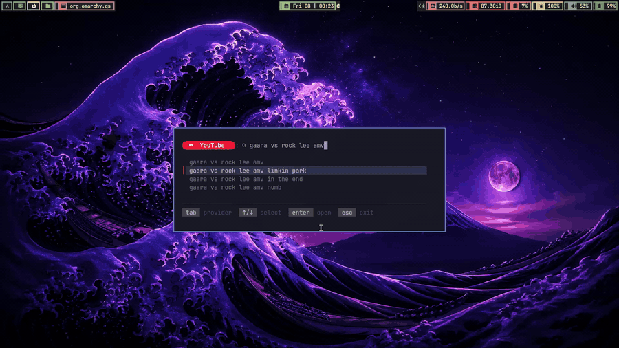
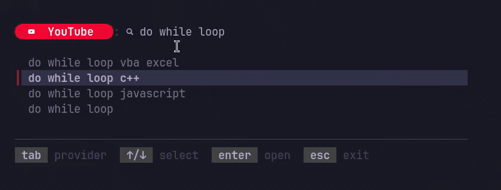

# QSearch

Keyboard-first search launcher for Linux.

```text
type query -> pick suggestion -> press enter -> open browser
```

The binary is `qs`.

## Examples

```sh
qs g
qs g golang channels
qs yt bubble tea tui
qs ytmusic radiohead
qs r linux window managers
```

Without a query, QSearch opens the TUI. With a query, it opens the provider search URL immediately.


## Providers

Built in:



```text
google: g
youtube: y, yt
ytmusic: ym, music
```

Custom providers live in:

```text
~/.config/qsearch/providers.toml
```

Create the default file:

```sh
qs init
```

Example:

```toml
[[providers]]
name = "reddit"
aliases = ["r"]
url = "https://www.reddit.com/search/?q={{query}}"
icon = ""
tag_bg = "#FF4500"
icon_color = "#FFFFFF"
text_color = "#FFFFFF"
```

Use `{{query}}` where the escaped search text should go.

## TUI

```text
tab         switch provider
shift+tab   switch provider back
up/down     select suggestion (ctrl+p/ctrl+n also work, i use vim btw)
enter       open
esc         exit
```

The UI uses Nerd Font icons.



## Install

```sh
go install github.com/prettyletto/qsearch/cmd/qs@latest
```

Make sure Go's bin directory is in your `PATH`:

```sh
export PATH="$PATH:$(go env GOPATH)/bin"
```

Then run:

```sh
qs g
```

For local development, you can also install from the cloned repo:

```sh
make install
```

Or build a local binary without installing:

```sh
make build
./qs g
```

## Launcher Setup

Omarchy:

```ini
windowrule = float on, match:class org.omarchy.qs
windowrule = center on, match:class org.omarchy.qs
windowrule = size 840 320, match:class org.omarchy.qs
bindd = SUPER SHIFT, SLASH, QSearch, exec, omarchy-launch-tui qs g
```

If your compositor does not see your shell `PATH`, use the full path to `qs`.

Plain Hyprland with Kitty:

```ini
bind = SUPER SHIFT, SLASH, exec, kitty --class qsearch -e qs g

windowrule = float on, match:class qsearch
windowrule = center on, match:class qsearch
windowrule = size 900 420, match:class qsearch
```

## Development

```sh
make test
make build
make run
```

Run from source:

```sh
go run ./cmd/qs g
```

QSearch should stay small: choose a provider, get suggestions, open the final browser URL.
